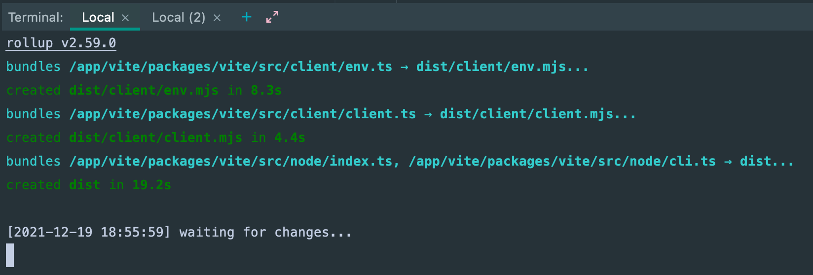
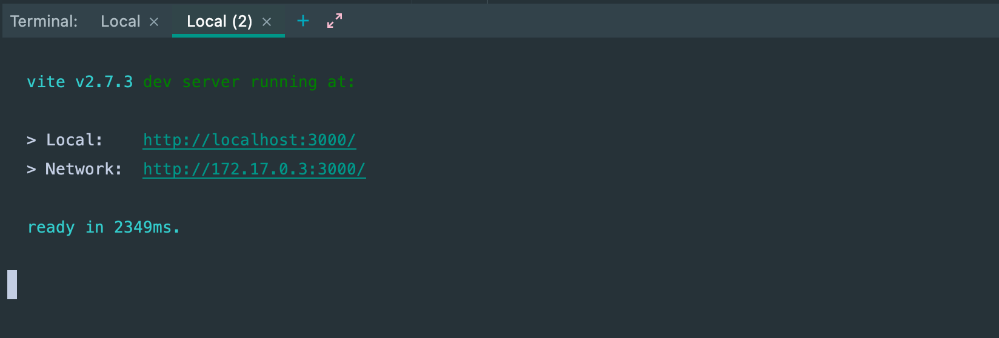
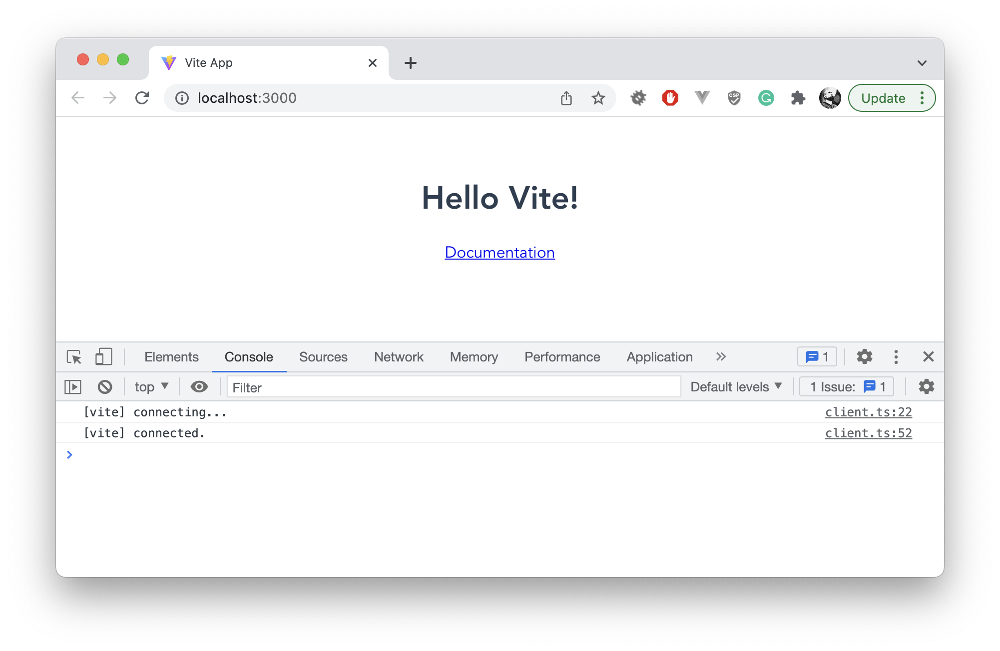

# Vite.js Docker Dev

Local development environment for developing vite.js via Docker container

## About

This is a local development environment for developing [vite.js](https://vitejs.dev) via a Docker container.

It takes care of the setup listed in the [Vite Contributing Guide](https://github.com/vitejs/vite/blob/main/CONTRIBUTING.md) in a Dockerized environment, which allows you to get it up and running quickly & easily.

The only requirement is that you have [Docker](https://www.docker.com/products/docker-desktop) installed (you do not need `node`, `npm`, `pnpm`, or anything else installed locally).

## Why Docker?

Developers who have adopted [Docker](https://www.docker.com/) for a containerized approach to development are used to not having to install a matching development infrastructure each time they approach a project.

This allows you to "shrink-wrap" the devops needed to run a project in a container, which will run anywhere, on any machine, without having to do any meticulous setup.

It also allows you to easily swap between basic things like node versions, without affecting your local computer. You can even run Vite in one version of Node, and your app in another.

## Quick Start

1. Clone down _or_ download the `vitejs-docker-dev` repository:

Clone: `git clone https://github.com/nystudio107/vitejs-docker-dev.git`

Download: [vitejs-docker-dev](https://github.com/nystudio107/vitejs-docker-dev/archive/refs/heads/develop.zip)

2. Go into the `vitejs-docker-dev` directory:

```
cd vitejs-docker-dev
```

3. Build the Docker image:
```
make docker
```
This will be somewhat lengthy, as it builds the Docker image, and then clones down the [vitejs](https://github.com/vitejs/vite/) repository, and installs all of its dependencies

4. Start Vite in development mode (located in the `vite/` dir):
```
make vite-pnpm run dev
```

...and ensure you **wait** until you see the following output:



5. Then in a new terminal, start the Vite app that you use for developing/testing (located in the `app/` dir):

```
make app-pnpm run dev
```

...and ensure you **wait** until you see the following output:



Then just navigate to `http://localhost:3000` in your browser, and the Vite app in `app/` will be running, using Vite running out of the `vite/` dir.



You can freely make changes to either the Vite.js codebase, or your app's codebase, and they will both be rebuilt when anything changes.

## Using Vite.js Docker Dev

Vite.js Docker Dev uses the venerable `make` command to automate setup and access to the Docker containers used. See the [Using Make & Makefiles to Automate your Frontend Workflow](https://nystudio107.com/blog/using-make-makefiles-to-automate-your-frontend-workflow) article for more on `make`.

The make tool is available for just about every platform you can imagine, and is installed with the [XCode CLI Tools](https://www.embarcadero.com/starthere/xe5/mobdevsetup/ios/en/installing_the_commandline_tools.html) on the Mac, and [WSL2](https://docs.microsoft.com/en-us/windows/wsl/install-win10) on Windows. Probably you have these installed already if you’re doing development.

From a high level point of view, you:

* Build the Docker image with `make docker` (typically just once)

Then, when you're ready to do Vite.js development, you:

* In a terminal, run Vite.js in development mode with `make vite-pnpm run dev`
* In a new terminal, run your app that uses Vite.js in development mode with `make app-pnpm run dev`

Then you can freely make changes to either the Vite.js codebase, or your app's codebase, and they will both be rebuilt when anything changes.

Below are details and options available in each of the provided `make` commands:

### `make docker`

The `make docker` command builds the Docker image, and then spins up a temporary `vitejs-build-dev` Docker container that:

1. Clones down the `vitejs/vite` repository for GitHub
2. Installs the Vite.js dependencies via `pnpm` in `vite/packages/vite/`
3. Installs the App dependencies via `pnpm` in `app/`

This is a lengthy operation that you typically only have to do once, because from then on the built image will be used.

You can think of the Docker image as a recipe, with all of ingredients and tools you need wrapped up inside it.

The Docker image will be named `nystudio107/vitejs-dev` and be tagged with the default `16-alpine` tag.

#### CLI Arguments

You can pass in optional CLI arguments to override the default settings that `make docker` uses:

* `TAG=` (default: `16-alpine`) - allows you to specify the official [node Docker image](https://hub.docker.com/_/node) tag that should be used. Using this, you can change the version of Node the container runs, e.g.: `make docker TAG="16-alpine"` will use the latest version of Node 16
* `VITE_REPO=` (default: `https://github.com/vitejs/vite.git`) - allows you to specify the Vite.js repository that should be cloned down, e.g.: `make docker VITE_REPO="https://github.com/my-vendor/my-vite-fork.git"`
* `VITE_DIR=` (default: `vite`) - allows you to specify the local name of the Vite.js repository directory, e.g.: `make docker VITE_DIR="my-vite-fork"`

Most of the time, you'll probably be using something like:
```
make docker VITE_REPO="https://github.com/my-vendor/my-vite-fork.git"
```
...to pull down your forked version of the `vitejs/vite` repository. But you might also want to use specific Node versions as well:
```
make docker TAG="16-alpine" VITE_REPO="https://github.com/my-vendor/my-vite-fork.git"
```
You can have as many differently tagged images created as you like, and you can specific which ones to use in subsequent `make` commands after they are built.

You also may edit these defaults in the `Makefile` if you don't wish to pass the arguments in via the CLI.

### `make vite-pnpm <command>`

The `make vite-pnpm` runs a long-running `vitejs-vite-dev` Docker container based off of the `nystudio107/vitejs-dev` Docker image.

This executes `pnpm` with the passed in `<command>` in the `vite/packages/vite/` directory.

Think of the `make vite-pnpm` prefix as a router that ensures the `pnpm` command runs in the right Docker container, in the right directory.

For example:

```
make vite-pnpm run dev
```
...translates to `pnpm run dev` inside of the `vitejs-vite-dev` Docker container, run in the `vite/packages/vite/` directory.

You then issue any `pnpm` commands you like using this, which will all be run in the proper context, e.g.:
```
make vite-pnpm install
```
...translates to `pnpm install` inside of the `vitejs-vite-dev` Docker container, run in the `vite/packages/vite/` directory.

#### CLI Arguments

You can pass in optional CLI arguments to override the default settings that `make vite-pnpm` uses:

* `TAG=` (default: `16-alpine`) - allows you to specify the tag for the `nystudio107/vitejs-dev` Docker image that should be used. e.g.: `make vite-pnpm TAG="16-alpine"` will use the Node 16 Docker image created with `make docker TAG="16-alpine"`
* `VITE_DIR=` (default: `vite`) - allows you to specify the local name of the Vite.js repository directory, e.g.: `make vite-pnpm VITE_DIR="my-vite-fork"`

#### Terminating

To terminate the `vitejs-app-dev` Docker container, type Control-C in the terminal.

### `make app-pnpm <command>`

The `make app-pnpm` runs a long-running `vitejs-vite-dev` Docker container based off of the `nystudio107/vitejs-dev` Docker image.

This executes `pnpm` with the passed in `<command>` in the `app/` directory.

Think of the `make app-pnpm` prefix as a router that ensures the `pnpm` command runs in the right Docker container, in the right directory.

For example:

```
make app-pnpm run dev
```
...translates to `pnpm run dev` inside of the `vitejs-vite-dev` Docker container, run in the `app/` directory.

You then issue any `pnpm` commands you like using this, which will all be run in the proper context, e.g.:
```
make app-pnpm install
```
...translates to `pnpm install` inside of the `vitejs-app-dev` Docker container, run in the `app/` directory.

#### CLI Arguments

You can pass in optional CLI arguments to override the default settings that `make app-pnpm` uses:

* `TAG=` (default: `16-alpine`) - allows you to specify the tag for the `nystudio107/vitejs-dev` Docker image that should be used. e.g.: `make app-pnpm TAG="16-alpine"` will use the Node 16 Docker image created with `make docker TAG="16-alpine"`
* `APP_DIR=` (default: `app`) - allows you to specify the local name of the App repository directory, e.g.: `make app-pnpm APP_DIR="my-app"`
* `PORT=` (default: `3000`) - allows you to specify the port that should be exposed on the host for Vite.js's HMR, e.g.: `make app-pnpm PORT="3001"`

#### Terminating

To terminate the `vitejs-app-dev` Docker container, type Control-C in the terminal.

### `make vite-sh`

Should you wish to get a shell "inside" of the `vitejs-vite-dev` Docker container, you can do:
```
make vite-sh
```
This will open up an interactive shell using `sh` that allows you to run arbitrary shell commands inside of the container

### `make app-sh`

Should you wish to get a shell "inside" of the `vitejs-app-dev` Docker container, you can do:
```
make app-sh
```
This will open up an interactive shell using `sh` that allows you to run arbitrary shell commands inside of the container

### `make clean`

This will clean the Vite.js Docker Dev environment entirely, allowing you to start from scratch.

Specifically, it will delete the following files & directories:
```
.pnpm-store
app/node_modules/
vite/
app/pnpm-lock.yaml
```

## Roadmap

* Create a `make` API for running commands from the root `vite/` directory, to allow you to run tests, etc. (right now you can do this with `make vite-sh`)
* Create a `plugins` directory, with an example plugin that is linked to the Vite.js app as a local repository via `file:`
